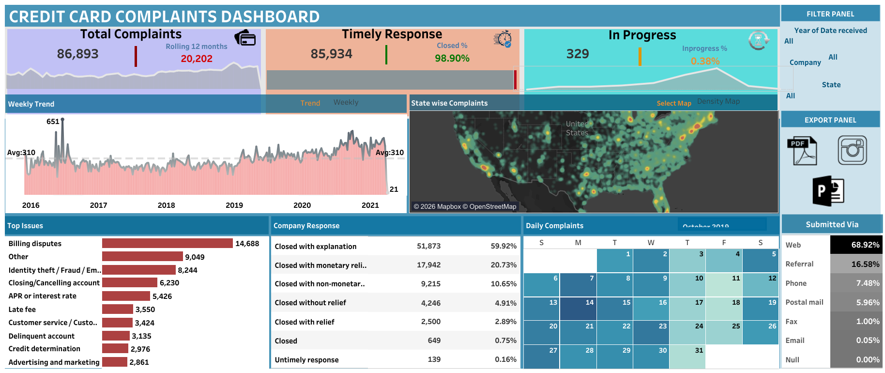

💳 Credit Card Complaints Dashboard | Tableau Project
🌐 Live Interactive Dashboard

🔎 Explore Here:
👉 https://public.tableau.com/app/profile/manikantan.p/viz/CreditCardComplaintsDashboard_17694433135230/CREDITCARDCOMPLAINTSDASHBOARD

📌 Project Overview

The Credit Card Complaints Dashboard is an interactive Tableau project built to analyze consumer complaint data within the credit card industry.

This dashboard provides insights into complaint trends, issue categories, company response efficiency, regional complaint distribution, and customer submission channels. It enables data-driven decision-making by highlighting operational performance and customer pain points.

📊 Dashboard Preview

  

🎯 Project Objectives

Monitor total complaint volume and trend patterns

Evaluate company response effectiveness

Identify high-frequency complaint categories

Analyze geographic complaint distribution

Understand preferred customer complaint channels

🛠 Tools & Technologies Used

Tableau – Data visualization & dashboard development

Microsoft Excel – Data preprocessing & cleaning

📊 Key Performance Indicators (KPIs)

Total Complaints: 86,893

Rolling 12 Months Complaints: 20,202

Timely Responses: 85,934

Closed Rate: 98.90%

In Progress Cases: 329

In Progress Rate: 0.38%

📈 Dashboard Features
🔹 Complaint Trend Analysis

Weekly trend from 2016–2021

Average weekly complaints: 310

Spike and fluctuation identification

🔹 Geographic Distribution

State-wise density map

High complaint concentration regions highlighted

🔹 Top Complaint Categories

Billing disputes

Identity theft / Fraud

Account closing issues

APR / Interest rate complaints

Late fee disputes

Customer service issues

🔹 Company Response Breakdown

Closed with explanation (59.92%)

Closed with monetary relief (20.73%)

Closed with non-monetary relief (10.65%)

Closed without relief (4.91%)

Untimely response (0.16%)

🔹 Complaint Submission Channels

Web (68.92%)

Referral (16.58%)

Phone (7.48%)

Postal mail (5.96%)

Fax & Email (Minimal usage)

🔹 Interactive Filters

Year of complaint

Company

State

💡 Business Insights

Billing disputes represent the highest complaint category, indicating billing transparency concerns.

High closure rate (>98%) reflects strong operational resolution efficiency.

Digital channels dominate complaint submission, emphasizing customer preference for online platforms.

Certain states show higher complaint density, suggesting regional service gaps.

Monetary relief cases indicate measurable financial impact on consumers.

📂 Repository Structure
Credit-Card-Complaints-Tableau-Dashboard/
│
├── data/                  # Excel dataset
├── dashboards/            # Tableau workbook (.twbx)
├── screenshots/           # Dashboard image
└── README.md

🚀 How to Use

Download the Tableau workbook file (.twbx) from the dashboards folder.

Open using Tableau Desktop or Tableau Public.

Use filters to explore complaints by year, company, and state.

👤 Author

Manikantan P
📊 Data Analyst | SQL | Tableau | Power BI
